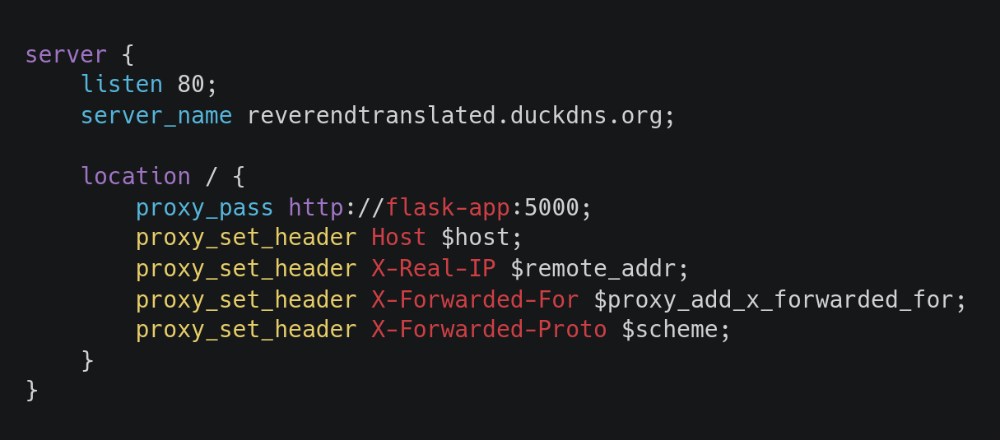

# ReverendTranslated

<p align="center">
    
</p>
<p align="center">
    <i>The translation is not perfect of course, but it is for sure better than those MTL sites</i><br>
    <i>The version of RI that is translated is in english, instead of the original chinese version, this might cause a further loss in meaning</i><br>
    <i>Thats why i'll be trying to add an option to choose which version to base the translation on</i><br>
</p>

---

## In order to be run locally you just have to:
```sh
git clone https://github.com/logbyjungle/ReverendTranslated.git
cd ReverendTranslated
pip install -m requirements.txt # use a venv if you want to
python main.py
```
and then enter the site at `localhost:5000`  
**OR you can just use a [Docker](https://www.docker.com/) container with port 5000 open 🐋**  

## If you instead want to host it for others you have to:  
- make sure you are not under **NAT**  
- `git clone https://github.com/logbyjungle/ReverendTranslated.git`  
- `cd ReverendTranslated`  

<p align="center">
    
</p>

- Use [Duckdns](https://www.duckdns.org) to get a static address  
- I advise setting up a script in the host machine to update the public ip for Duckdns  
- make a `.env` file and put these info in this following format:  
```sh
DOMAIN=yourdomain.com
TZ=Europe/Rome
TOKEN=yourduckdnstoken
EMAIL=youremail@gmail.com # its required apparently
```
- `docker compose up -d --build` Use Docker Compose instead of normal Docker  
- Port forward ports **80(http) and 443(https)**, remember to make your **ipv4** address static  

### If you also want to make everything more secure you have to use **https**:  
- go inside the shell of the nginx container and run `activate_https.sh`  
In case you dont intend to use Duckdns here is the content of the script, just modify the certbot part  
```sh
certbot certonly --non-interactive --agree-tos --email YOUREMAIL --preferred-challenges dns --authenticator dns-duckdns --dns-duckdns-token "YOURTOKEN" --dns-duckdns-propagation-seconds 60 -d "YOURSUBDOMAIN.duckdns.org"
nginx -s quit
cd etc/nginx/conf.d/
mv nginx.conf nginx.conf.disabled
mv nginx.conf.https nginx.conf
nginx -s reload
```  
The certificates can be managed in the `etc` folder, you can also create it and put inside them before creating the container  

---

This is a site hosted utilizing flask, it takes pages of RI's chapters from other sites and translate them by using google translate via selenium  

The objective to be reached is spreading *Gu Zhen Ren*'s work across the globe by making sure everyone can read it  

As of now the project is still not really made to be used:  
1. the site lacks a good UI  
2. the requests arent handled in parallel due to selenium's limitations, this means that the entire way the project work will have to be revolutionized  
3. there might be a bunch of issues with the translation, since the project is made for everyone it is right that those who find errors in the translation and want to fix the issue must be able to do so  

> ***TODO***  
> add a loading page  
> add a check to see if the source or translation is less than 500 characters(or another way to check if it was unsuccessful)  
> implement github actions  
> implement security features(protection from ddos)  
> add github badges  
> make the docker container avaiable easily  
> make dark/light mode and buttons get activated as soon as the page starts loading  

*This repository is open-source under the GPL 3.0 license, but that applies **only to the code**.  
The translated text of *Reverend Insanity* included or produced by this project is **unauthorized and copyrighted** by the original author and publisher.  
This project **does not grant permission** to redistribute or commercialize these translations.*  
